  

<h3 align="center">Frontend Engineer · Legacy Refactoring · Architecture & CI/CD</h3>

  6+ лет превращаю legacy-код в масштабируемые системы. 
  От пиксель-перфекта до Kubernetes-деплоя.

   
   
  

---

## 👋 Обо мне

Фронтенд-инженер с 6+ годами опыта. Специализируюсь на **рефакторинге legacy-проектов**, построении архитектуры и внедрении CI/CD. Верю, что красивый интерфейс начинается с красивой кодовой базы.

**Что я делаю:**

> Большинство моих рабочих проектов — в приватных репозиториях (NDA). Этот профиль демонстрирует чистые реализации и open-source инструменты.

-  Ускоряю рендеринг в 3× через кастомный виртуальный скролл
- 📦 Уменьшаю бандлы на 30% при миграции jQuery → Vue + TypeScript
- 🏗️ Внедряю Feature-Sliced Design — онбординг новых разработчиков в 2× быстрее
- 🐳 Упаковываю фронтенд в Docker и деплою в Kubernetes
- 🤖 Активно использую AI-инструменты в работе (AI-агенты, AI-чаты)

**Стек, с которым живу:**
`Vue 3 / Nuxt 4` · `React / Next.js` · `TypeScript (strict)` · `Pinia / Vue Query` · `Docker / Nginx / K8s` · `GitLab CI` · `Storybook`

---

## 📊 Доказательства в цифрах

| Проект | Задача | Результат | Стек |
| :--- | :--- | :--- | :--- |
| **Enterprise DocFlow** (ITFB Group) | Конструктор сценариев обработки документов | Виртуальный скролл ускорил рендеринг атрибутов в **3×** | Vue, Pinia, TypeScript, Vue Draggable |
| **Real Estate Platform** (idaproject) | Миграция с jQuery + Django на Vue + Nuxt | Разработка ускорена на **40%**, бандл уменьшен на **30%**, загрузка страниц в **2×** быстрее | Vue, Nuxt, TypeScript, Tailwind |
| **3D Kitchen Visualizer** (Fortech) | Дублирование UI-компонентов | Внедрение Storybook сократило дублирование кода на **50%** | Vue, TypeScript, Storybook, Vuetify |
| **Feature-Sliced Refactor** (ITFB Group) | Хаотичная структура кодовой базы | FSD ускорила разработку фич на **20%**, онбординг в **2×** быстрее | FSD, ESLint, Prettier, Husky |

---

## 💼 Опыт работы

**ITFB Group** · Frontend Engineer · Nov 2023 — Present
> Платформа автоматизации документооборота для enterprise-клиентов (аналог Abby).
> - Конструктор сценариев обработки документов
> - Кастомный виртуальный скролл (×3 рендеринг)
> - Бесшовный рендеринг страниц с панорамированием и масштабированием (VBox)
> - GitLab CI → Docker → Kubernetes pipeline

**idaproject** · Frontend Engineer · Jun 2022 — Oct 2023
> Проект жилой и коммерческой недвижимости для застройщика.
> - Миграция jQuery → Vue + TypeScript (−30% бандл, +40% скорость разработки)
> - Миграция Django Templates → Nuxt (×2 загрузка страниц)
> - Модуль динамической фильтрации комнат

**Fortech** · Frontend Engineer · Feb 2020 — May 2022
> Аналитика гостиничной сети + 3D визуализация кухонных гарнитуров.
> - JWT авторизация, настройка ESLint/Prettier/Webpack/TS
> - Внедрение Storybook (−50% дублирования UI-кода)

---

## 🛠️ Core Stack

**Languages & Frameworks**

**Architecture & Quality**

**DevOps & Infrastructure**

**Styling & Tools**

<!-- ---

## 📊 Activity

  
  

 -->

---

<h4 align="center">
  Приглашаю ознакомиться с резюме в интерактивном формате — <a href="https://mchuprin.github.io/chuprin-cv/ru/"><strong>Cyberpunk терминал</strong></a>
</h4>